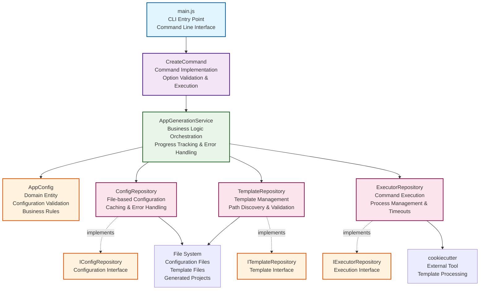
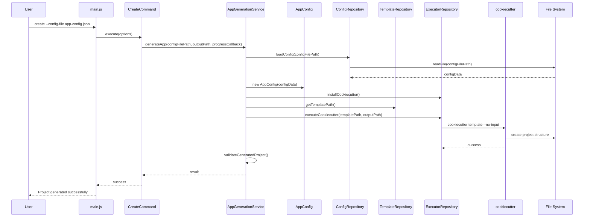

# AAS Core AppGen

High-performance CLI tool for generating React Native apps using cookiecutter templates with Clean Architecture.

## 🚀 Quick Start

### Build
```bash
# Manual build process (recommended)
rm -rf .template
ncc build index.js -o build/lib
git clone https://github.com/AppAnySite/aas-app-template.git .template
```

### Run
```bash
# Create project in current directory
node build/lib/index.js create --config-file app-config.json

# Create project in specific directory
node build/lib/index.js create --config-file app-config.json --output-path ./my-projects
```

### Test
```bash
# Test with sample config
node build/lib/index.js create --config-file /Users/hvetagir/Documents/aas-app-template/hooks/source/app-config.json
```

## 📋 Usage

### Configuration File Format
```json
{
  "app": {
    "name": "MyApp",
    "bundleId": "com.company.myapp",
    "androidPackageName": "com.company.myapp"
  }
}
```

### CLI Options
- `--config-file`: Path to JSON configuration file (required)
- `--output-path`: Path where project should be created (optional, default: current directory)
- `--verbose`: Enable verbose mode
- `--debug`: Enable debug mode

## 🏗️ Architecture

### System Overview


### Execution Flow


## 📁 Project Structure

```
src/
├── domain/                 # Business logic and entities
│   ├── entities/          # AppConfig domain entity
│   └── repositories/      # Repository interfaces
├── application/           # Application services
│   └── services/         # AppGenerationService
├── infrastructure/        # External concerns
│   └── repositories/     # Repository implementations
├── modules/              # Command modules
│   └── create/          # CreateCommand implementation
└── utils/               # Shared utilities
```

## ⚡ Performance

- **Generation Time**: ~500ms (0.5 seconds)
- **Build Time**: ~650ms
- **Memory Usage**: ~50MB
- **Template Processing**: < 100ms

## 🔧 Features

- **Clean Architecture**: Clear separation of concerns
- **Progress Tracking**: Real-time progress with timestamps
- **Error Handling**: Comprehensive error management and cleanup
- **Output Path Support**: Create projects in any directory
- **Template Cloning**: Always uses latest template from GitHub
- **High Performance**: Optimized for speed and efficiency

## 📦 Build Process

### Manual Build (Recommended)
```bash
# Remove existing template
rm -rf .template

# Build with ncc
ncc build index.js -o build/lib

# Clone template
git clone https://github.com/AppAnySite/aas-app-template.git .template
```

### npm Scripts
```bash
# Shows manual commands
npm run build

# Build ncc only
npm run build:ncc
```

## 🧪 Testing

```bash
# Test basic functionality
node build/lib/index.js create --config-file app-config.json

# Test with custom output path
node build/lib/index.js create --config-file app-config.json --output-path ./test-output

# Test with nested directory (auto-created)
node build/lib/index.js create --config-file app-config.json --output-path ./projects/react-native
```

## 📄 License

MIT License

## 🆘 Support

- GitHub Issues: [Create an issue](https://github.com/AppAnySite/aas-core-appgen/issues)
- Email: dev@appanysite.com
