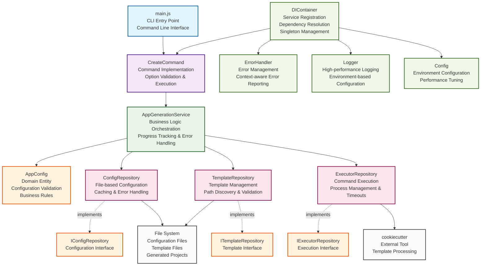

# Architecture Overview - AAS Core AppGen

## System Architecture Diagram

## Architecture Layers

### 1. **Entry Point Layer**
- **main.js**: CLI entry point with command parsing and error handling

### 2. **Command Layer**
- **CreateCommand**: Handles CLI command execution and option validation

### 3. **Application Layer**
- **AppGenerationService**: Orchestrates the entire app generation process

### 4. **Domain Layer**
- **AppConfig**: Business entity with validation and business rules
- **Repository Interfaces**: Contracts for data access operations

### 5. **Infrastructure Layer**
- **Repository Implementations**: Concrete implementations of data access
- **ConfigRepository**: File-based configuration management
- **TemplateRepository**: Template discovery and management
- **ExecutorRepository**: External command execution

### 6. **Utility Layer**
- **ErrorHandler**: Comprehensive error management
- **Logger**: High-performance logging
- **Config**: Environment-based configuration
- **DIContainer**: Dependency injection management

### 7. **External Dependencies**
- **cookiecutter**: External tool for template processing
- **File System**: Configuration files, templates, and generated projects

## Design Principles

- **Clean Architecture**: Clear separation of concerns
- **Dependency Inversion**: High-level modules don't depend on low-level modules
- **Single Responsibility**: Each class has one clear purpose
- **Interface Segregation**: Clients depend only on interfaces they use
- **Performance Optimization**: Caching, parallel operations, and O(1) lookups
