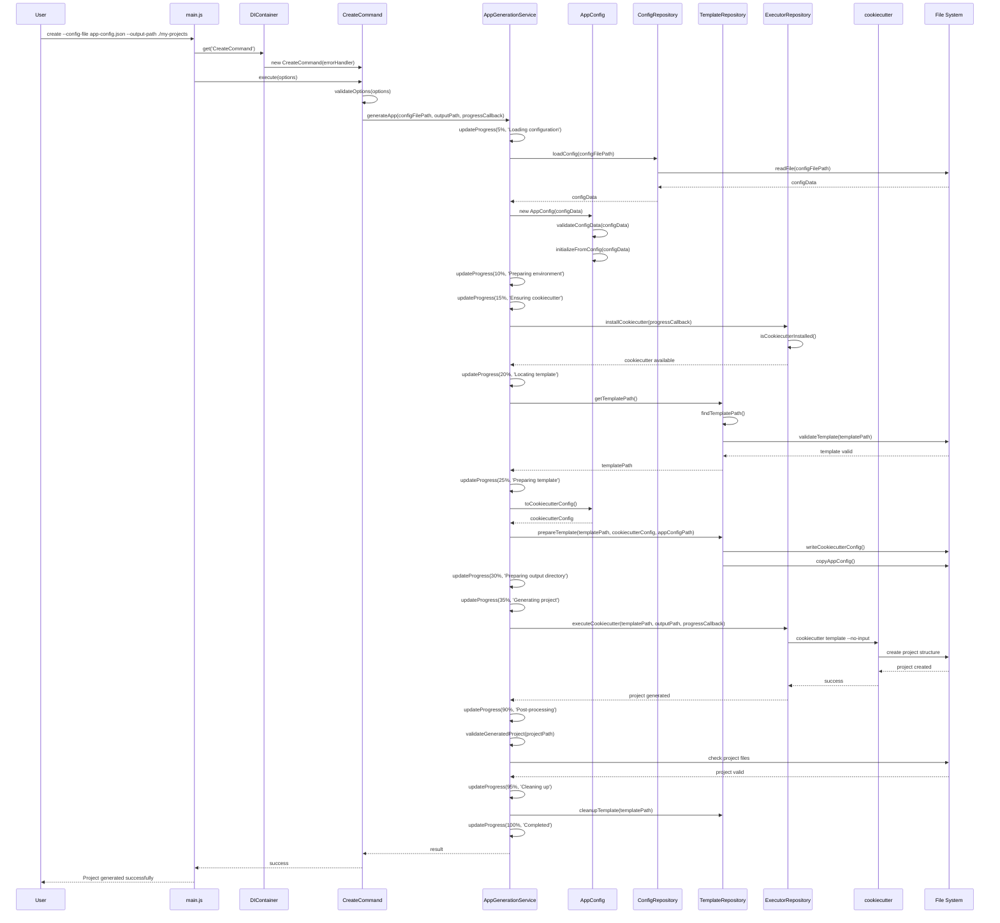

# Sequence Diagram - Create Command Flow

## Complete Application Generation Sequence

## Sequence Flow Explanation

### 1. **Command Initialization**
- User executes CLI command with config file path
- Main.js parses command and gets CreateCommand from DI container
- CreateCommand validates options and starts execution

### 2. **Configuration Loading (5%)**
- AppGenerationService loads configuration file
- ConfigRepository reads JSON file from file system
- AppConfig validates configuration structure and required fields
- Domain entity is initialized with validated data

### 3. **Environment Preparation (10-15%)**
- System checks if cookiecutter is installed
- If not installed, automatically installs cookiecutter
- Progress is tracked during installation process

### 4. **Template Preparation (20-25%)**
- TemplateRepository locates and validates template
- System finds template in project directory
- Template configuration is prepared with user data
- cookiecutter.json and app-config.json are written to template

### 5. **Project Generation (30-90%)**
- System prepares output directory (creates if it doesn't exist)
- ExecutorRepository executes cookiecutter command in specified output path
- cookiecutter processes template and creates project structure
- Progress is tracked during generation (35% to 90%)
- Project files are created in the specified output directory

### 6. **Post-processing (90-95%)**
- System validates generated project
- Checks for essential files (package.json, app.json, index.js)
- Ensures project structure is complete

### 7. **Cleanup (95-100%)**
- Temporary files are cleaned up
- Template cache is cleared
- Final success message is displayed

## Key Performance Optimizations

### **Parallel Operations**
- Template validation and cookiecutter installation can run in parallel
- File operations are optimized with caching

### **Progress Tracking**
- Real-time progress updates with timestamps
- Progress only increases (no backward movement)
- Cached progress to avoid duplicate updates

### **Error Handling**
- Comprehensive error handling at each step
- Automatic cleanup on errors
- Context-aware error messages

### **Caching Strategy**
- Configuration file caching for O(1) access
- Template path caching for repeated access
- Process status caching for cookiecutter availability

## Performance Metrics

- **Total Execution Time**: ~500ms (0.5 seconds)
- **Configuration Loading**: ~5ms
- **Template Preparation**: ~10ms
- **Project Generation**: ~300ms
- **Post-processing**: ~5ms
- **Cleanup**: ~1ms

## Error Recovery

- **Configuration Errors**: Detailed validation messages
- **Template Errors**: Automatic template discovery fallback
- **Execution Errors**: Automatic cleanup and retry logic
- **File System Errors**: Graceful handling with fallbacks
